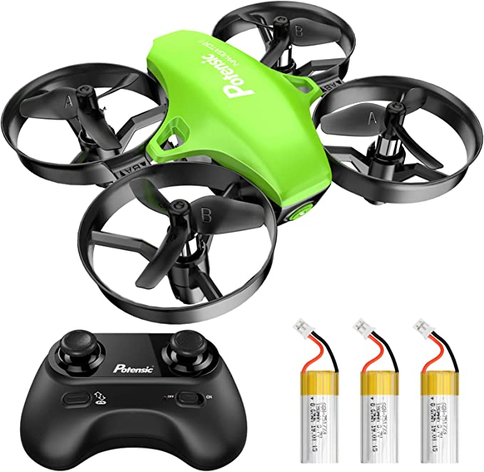
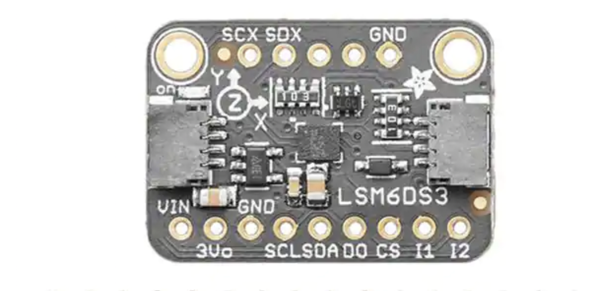

# ESE519_Final
For ESE 519 Final project. Drone with learning.

- **code:**
  - **working:**
    - RP2040
    - balance board Python code
    - PIO PWM code on PIO 0
    - I2C communication on PIO 1 from lab 2B
  - **in-progress:**
    - Pico4ML
    - Machine learning
    - gyroscope
  - **libraries:**
    - pwm.pio, uart_rx.pio, uart_tx.pio
    - pico_stdlib, hardware_pio, hardware_pwm
    - pico_multicore
  - **reference:**
    - https://cla.purdue.edu/academic/rueffschool/ad/etb/resources/robotics01_SN754410_Arduino.pdf
- **media:**
  - **materials:**
    - Pico4ML
    
    

    - MiniDrone

    

    - RP2040
    
    

    -LSM6DS3

    

  - **design:**
  * Self-designed drone with hacking:
  Hacking:
         1. Borrow the shell of bought drone.
         2. Hacking the structure.
         3. Hacking the signals to control the servo.  

 
 
  
  - **troubleshooting:**
    - How to make the fan blades turn from 0
    - Using an oscilloscope to hack the original circuit to learn that the servo is DC input,then the group using pio and pwm to modify the value of the DC current and let the servo rotate with different speed. 

  - **demos:**
    - video
    The demo is given as follows:  
    
    
    
    - circuit connection
    
    

- **diagram:**
 
 
